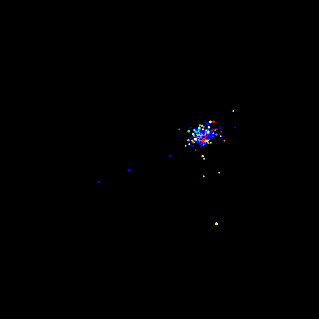
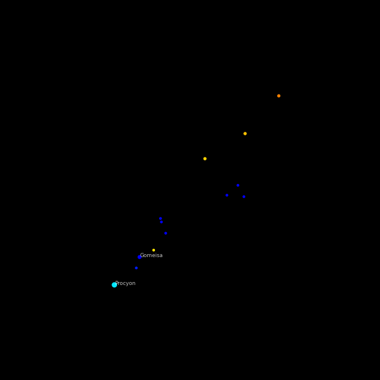

# StarScholar3D

## Contents
- [Overview](#overview)
- [Features](#features)
- [Star Visualisation Methodology](#star-visualisation-methodology)
- [Installation](#installation)
- [Multiprocessing and Performance](#multiprocessing-and-performance)
- [Visualisations](#visualisations)
- [License](#license)
- [Acknowledgments](#acknowledgments)

## Overview
StarScholar3D is an innovative project that leverages the extensive data from the Yale Bright Star catalogue. This project is centered around the visualisation and study of stars, constellations, and asterisms in a dynamic 3D environment. By transforming equatorial coordinates into cartesian coordinates, StarScholar3D offers a unique perspective on the celestial bodies.

## Features
- **Multiprocessing**: Uses Python library multiprocessing to enable multiple cores of the CPU to perform tasks. In practise reduced computational time by 1 / 3 when using 6 cores compared to 1. Does require lots of RAM
- **Data Utilisation**: Utilises the comprehensive Yale Bright Star catalogue, IAU Star Names and SIMBAD.
- **3D Visualisation**: Plots stars, constellations, and asterisms in an interactive 3D space.
- **Coordinate Transformation**: Converts equatorial coordinates to cartesian coordinates for accurate 3D plotting.
- **Interactive Experience**: Enables users to explore and interact with the 3D star map.
- **GIF Capture**: Enables the capturing of GIFs of the data visualisation.

## Star Visualisation Methodology
In StarScholar3D, we employ specific astronomical metrics to enhance the visualisations:

- **B-V Color Index**: The B-V color index is used in StarScholar3D to approximate the observed colour of stars. This index is a measure of the colour difference between a star's blue (B) and visual (V) magnitudes.
- **V Magnitude (Vmag)**: The V magnitude of a star indicates its brightness as seen from Earth. In StarScholar3D, we use this metric to approximate the size of the stars in our 3D environment. Larger sizes are used for stars with lower (brighter) V magnitudes, allowing users to easily discern the relative brightness of stars.

These methodologies enable users to not only explore the positions of celestial bodies but also gain insights into their physical characteristics.

## Installation
To get started with StarScholar3D, follow these steps:

1. **Clone the Repository**:
    Make sure to use `--depth 1` otherwise the download will be over 1GB
	```
	git clone --depth 1 https://github.com/WDoyle123/StarScholar3D.git
	cd StarScholar3D
	```
2. **Set Up a Virtual Environment (Optional but Recommended)**:
	```
	python -m venv venv
	source venv/bin/activate  # On Windows, use 'venv\Scripts\activate'
	```
3. **Install Dependencies**:
	```
	pip install -r requirements.txt
	```
4. **Configure main.py**:

	Navigate to the src directory and open main.py in your preferred text editor:

	```
	cd src/
	vim main.py # Or use another editor
	```
	In main.py, you will find several configuration flags. If all Flags are false the programme will still plot figures to view. Here's what each Flag does and how you can adjust them:
	
	```
	# Flags for toggling GIF capture and plot display
	capture_gif_flag = True  # Set to True to enable GIF capture, False to disable
	show_plot_flag = False   # Set to True to display plots, False to hide them

	# Flags for processing different astronomical features
	process_asterisms = True       # Set to True to process asterisms, False to skip
	process_constellations = True  # Set to True to process constellations, False to skip
	process_all_stars = True       # Set to True to process all stars, False to skip
	```
5. **Run the Application**:
	```
	python main.py
	```

## Multiprocessing and Performance

StarScholar3D efficiently processes large volumes of astronomical data using Python's multiprocessing capabilities. This approach significantly accelerates data processing by distributing tasks across multiple CPU cores. Here's a snippet demonstrating how multiprocessing is integrated:

```
# Determine the number of processes to use, leaving one core free
# Adjust this value if needed
num_processes = os.cpu_count() - 1

with Pool(processes=num_processes) as pool:
	# Parallel processing of each asterism
    args = [(item, plot, gif) for item in asterism_items]
    pool.starmap(process_asterism, args)
```
The code dynamically calculates the number of available CPU cores and reserves one to ensure system stability. 

**It is important to adjust num_processes based on your system's RAM capacity to avoid overloading.**

 For instance, with 16GB RAM + 4GB SWAP, using 6 cores might be optimal.

## Visualisations
Below are some visualisations created using StarScholar3D:



*Visualisation of all stars in the Yale Bright Stars Catalogue*


*Visualisation of the Big Dipper Asterism.*



*Visualisation of the Canis Minor Constellation.*
 
## License
see the [LICENSE](LICENSE) file for details.

## Acknowledgments
- [Yale Bright Star Catalogue](https://heasarc.gsfc.nasa.gov/db-perl/W3Browse/w3table.pl?tablehead=name%3Dbsc5p&Action=More+Options)
- [International Astronomical Union](https://www.iau.org/public/themes/naming_stars/)
- [SIMBAD](http://simbad.cds.unistra.fr/simbad/sim-fscript)


## [Back to Top](#starscholar3d)
